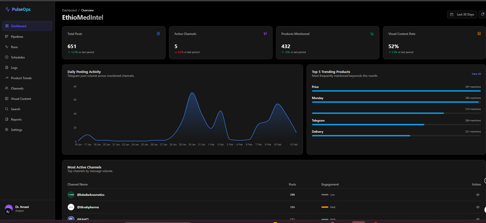
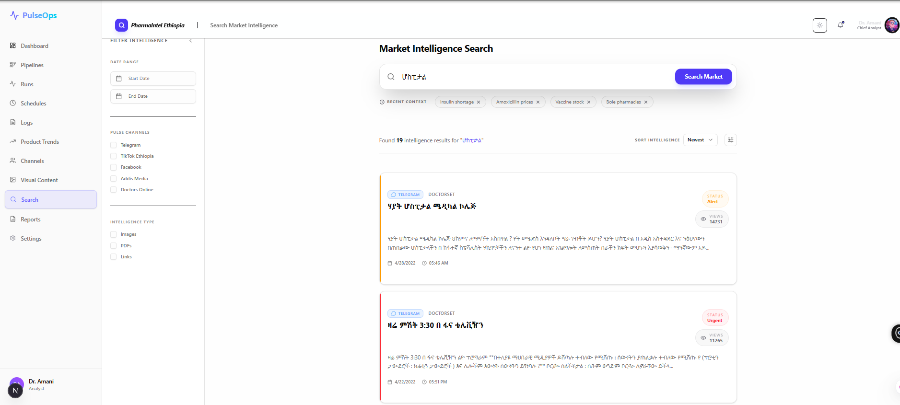
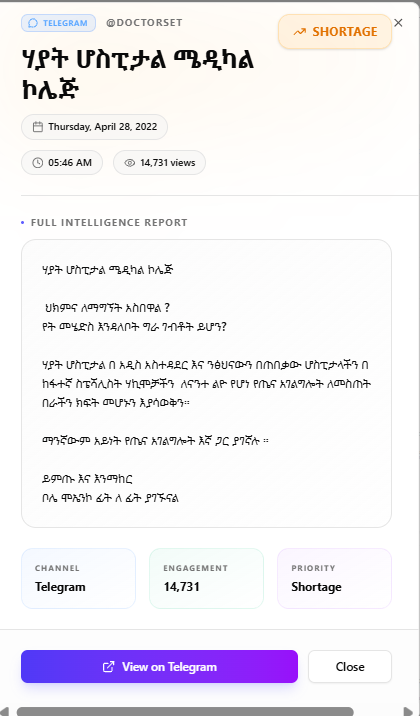

# 🏥 EthioMedIntel - Medical Telegram Intelligence Platform

> **End-to-end data pipeline and analytics platform for Ethiopian medical Telegram channels**

[](LICENSE)
[](https://www.python.org/downloads/)
[](https://nextjs.org/)
[](https://fastapi.tiangolo.com/)

## 📹 Demo Video

[](https://github.com/user-attachments/assets/693deff3-d319-4200-bcfc-f3c3ac7b395)


## 📋 Table of Contents

- [Overview](#-overview)
- [Features](#-features)
- [Architecture](#-architecture)
- [Tech Stack](#-tech-stack)
- [Getting Started](#-getting-started)
- [Usage](#-usage)
- [API Documentation](#-api-documentation)
- [Project Structure](#-project-structure)
- [Screenshots](#-screenshots)
- [Contributing](#-contributing)
- [License](#-license)

---

## 🎯 Overview

**EthioMedIntel** is a comprehensive data intelligence platform designed for the Ethiopian medical industry. It scrapes, processes, and analyzes data from Telegram medical channels, providing actionable insights through a beautiful, modern web interface.

### What It Does

1. **📥 Data Collection**: Automatically scrapes messages and images from Ethiopian medical Telegram channels
2. **🔄 ETL Pipeline**: Transforms raw data into a structured star schema using dbt
3. **🤖 AI Enrichment**: Classifies images using YOLOv8 object detection
4. **📊 Analytics Dashboard**: Visualizes trends, channel performance, and product mentions
5. **🔍 Intelligent Search**: Full-text search with advanced filtering and detail views
6. **🌓 Multi-Theme Support**: Beautiful light and dark modes

---

## ✨ Features

### 🎨 Frontend (Next.js + React)
- **Premium UI/UX**: Linear-inspired design with glassmorphism and smooth animations
- **Dashboard Analytics**: Real-time business metrics, activity charts, and trending products
- **Market Intelligence Search**: Advanced search with filters, pagination, and beautiful detail modals
- **Channel Performance**: Track engagement, posting frequency, and growth metrics
- **Visual Content Analysis**: Browse and analyze images from medical channels
- **Reports Generation**: Export insights and analytics
- **Theme Switching**: Seamless light/dark mode with `next-themes`

### ⚙️ Backend (FastAPI + PostgreSQL)
- **RESTful API**: Fast, documented endpoints with automatic OpenAPI/Swagger docs
- **Star Schema**: Optimized dimensional data model for analytics
- **Full-Text Search**: PostgreSQL-powered message search
- **Data Quality**: Comprehensive dbt tests and validations
- **Image Classification**: YOLO-based categorization (promotional, product, lifestyle, other)

### 🔧 Data Pipeline (Dagster + dbt)
- **Orchestration**: Automated daily pipeline runs with Dagster
- **Transformations**: Clean, tested dbt models (staging → marts)
- **Incremental Loads**: Efficient data updates
- **Monitoring**: Pipeline health checks and error tracking

---

## 🏗️ Architecture

```
┌─────────────────────────────────────────────────────────────┐
│                    Telegram Channels                         │
│              (Ethiopian Medical Communities)                 │
└────────────────────┬────────────────────────────────────────┘
                     │
                     ▼
┌─────────────────────────────────────────────────────────────┐
│                  Scraper (Telethon)                          │
│         • Messages  • Images  • Metadata                     │
└────────────────────┬────────────────────────────────────────┘
                     │
                     ▼
┌─────────────────────────────────────────────────────────────┐
│              PostgreSQL (Raw Schema)                         │
│                raw.telegram_messages                         │
└────────────────────┬────────────────────────────────────────┘
                     │
                     ▼
┌─────────────────────────────────────────────────────────────┐
│                 dbt Transformations                          │
│   Staging → Marts (Star Schema)                             │
│   • dim_channels  • dim_dates                                │
│   • fct_messages  • fct_image_detections                     │
└────────────────────┬────────────────────────────────────────┘
                     │
          ┌──────────┴──────────┐
          ▼                     ▼
┌──────────────────┐  ┌──────────────────────┐
│   FastAPI        │  │   Next.js Frontend   │
│   REST API       │  │   • Dashboard        │
│   Port: 8000     │  │   • Search           │
└──────────────────┘  │   • Analytics        │
                      │   Port: 3000         │
                      └──────────────────────┘
```

### Data Model (Star Schema)

**Fact Tables:**
- `fct_messages` - Message-level data with metrics
- `fct_image_detections` - YOLO classification results

**Dimension Tables:**
- `dim_channels` - Channel metadata and aggregates
- `dim_dates` - Date dimension for time-series analysis

---

## 🛠️ Tech Stack

### Frontend
| Technology | Purpose |
|-----------|---------|
| **Next.js 16** | React framework with App Router |
| **TypeScript** | Type-safe development |
| **Tailwind CSS** | Utility-first styling |
| **shadcn/ui** | Premium UI components |
| **Recharts** | Data visualization |
| **next-themes** | Theme management |
| **Lucide Icons** | Beautiful icon library |

### Backend
| Technology | Purpose |
|-----------|---------|
| **FastAPI** | High-performance API framework |
| **PostgreSQL 15** | Relational database |
| **SQLAlchemy** | ORM and query builder |
| **Pydantic** | Data validation |
| **dbt** | Data transformation |
| **Dagster** | Pipeline orchestration |

### Data & ML
| Technology | Purpose |
|-----------|---------|
| **Telethon** | Telegram API client |
| **YOLOv8** | Object detection |
| **Pandas** | Data manipulation |
| **Docker** | Containerization |

---

## 🚀 Getting Started

### Prerequisites

- **Python 3.12+**
- **Node.js 18+**
- **Docker Desktop**
- **Telegram API Credentials** ([Get them here](https://my.telegram.org))

### Quick Start

#### 1. Clone the Repository

```bash
git clone https://github.com/game-ale/medical-telegram-warehouse.git
cd medical-telegram-warehouse
```

#### 2. Environment Setup

Create `.env` file in the project root:

```env
# Telegram API
API_ID=your_api_id
API_HASH=your_api_hash
PHONE_NUMBER=your_phone_number

# PostgreSQL
DB_USER=postgres
DB_PASSWORD=postgres
DB_HOST=localhost
DB_PORT=5433
DB_NAME=medical_warehouse
```

#### 3. Install Dependencies

**Backend:**
```bash
python -m venv venv
venv\Scripts\activate  # Windows
# source venv/bin/activate  # macOS/Linux

pip install -r requirements.txt
```

**Frontend:**
```bash
cd frontend
npm install
cd ..
```

#### 4. Start the Application

Follow the commands in order (each in a separate terminal):

**Terminal 1 - Database:**
```bash
docker-compose up -d postgres
```

**Terminal 2 - Dagster:**
```bash
dagster dev -f pipeline.py
```
Access Dagster UI at: http://localhost:3001

**Terminal 3 - API:**
```bash
uvicorn api.main:app --reload --port 8000
```
Access API docs at: http://localhost:8000/docs

**Terminal 4 - Frontend:**
```bash
cd frontend
npm run dev
```
Access application at: http://localhost:3000

> 💡 **Tip**: See [STARTUP_GUIDE.md](./STARTUP_GUIDE.md) for detailed startup instructions and troubleshooting.

---

## 📖 Usage

### Running the Data Pipeline

#### 1. Scrape Telegram Data
```bash
python src/scraper.py
```
Downloads messages and images from configured channels.

#### 2. Load to Database
```bash
python scripts/load_to_postgres.py
```
Loads raw JSON data into PostgreSQL.

#### 3. Transform with dbt
```bash
python scripts/dbt_wrapper.py run
python scripts/dbt_wrapper.py test
```
Builds star schema and runs data quality tests.

#### 4. Enrich with YOLO
```bash
python src/yolo_detect.py
python scripts/load_yolo_to_postgres.py
python scripts/dbt_wrapper.py run
```
Classifies images and updates the warehouse.

#### 5. Orchestrate with Dagster
```bash
dagster dev -f pipeline.py
```
Automates the entire pipeline on a schedule.

### Using the Web Application

1. **Dashboard** (`/`) - View business metrics and activity trends
2. **Search** (`/search`) - Search messages with advanced filters
   - Try keywords: `medical`, `hospital`, `equipment`
   - Click result cards to view beautiful detail modals
3. **Product Trends** (`/trends`) - Analyze trending medical products
4. **Channels** (`/channels`) - Monitor channel performance
5. **Visual Content** (`/visuals`) - Browse classified images
6. **Reports** (`/reports`) - Generate analytics reports

---

## 📡 API Documentation

### Base URL
```
http://localhost:8000
```

### Key Endpoints

#### Search Messages
```http
GET /api/search/messages?query=medical&limit=20
```

**Response:**
```json
{
  "total": 5,
  "data": [
    {
      "message_id": 190002,
      "channel_name": "tikvmedicalequipment",
      "message_date": "2022-02-08T00:00:00",
      "message_text": "Medical equipment available...",
      "view_count": 495
    }
  ]
}
```

#### Business Summary
```http
GET /api/reports/summary
```

#### Top Products
```http
GET /api/reports/top-products?limit=10
```

#### Channel Activity
```http
GET /api/channels/{channel_name}/activity
```

#### Visual Content Stats
```http
GET /api/reports/visual-content
```

**Full API Documentation:** http://localhost:8000/docs (Swagger UI)

---

## 📁 Project Structure

```
medical-telegram-warehouse/
├── 📱 frontend/                    # Next.js application
│   ├── app/
│   │   ├── (dashboard)/           # Dashboard routes
│   │   │   ├── page.tsx          # Main dashboard
│   │   │   ├── search/           # Market intelligence
│   │   │   ├── trends/           # Product trends
│   │   │   ├── channels/         # Channel analytics
│   │   │   ├── visuals/          # Visual content
│   │   │   └── reports/          # Reports
│   │   ├── layout.tsx            # Root layout with ThemeProvider
│   │   └── globals.css           # Global styles + theme variables
│   ├── components/
│   │   ├── dashboard/            # Dashboard widgets
│   │   ├── search/               # Search components
│   │   ├── layout/               # Sidebar, header
│   │   ├── ui/                   # shadcn/ui components
│   │   ├── theme-provider.tsx
│   │   └── mode-toggle.tsx
│   ├── lib/
│   │   └── api.ts                # API client
│   └── package.json
│
├── 🔧 api/                         # FastAPI backend
│   ├── main.py                   # API routes
│   ├── database.py               # Database connection
│   └── schemas.py                # Pydantic models
│
├── 📊 medical_warehouse/           # dbt project
│   ├── models/
│   │   ├── staging/
│   │   │   ├── stg_telegram_messages.sql
│   │   │   └── stg_yolo_detections.sql
│   │   └── marts/
│   │       ├── dim_channels.sql
│   │       ├── dim_dates.sql
│   │       ├── fct_messages.sql
│   │       └── fct_image_detections.sql
│   ├── dbt_project.yml
│   └── profiles.yml
│
├── 🤖 src/                         # Data collection & ML
│   ├── scraper.py                # Telegram scraper
│   └── yolo_detect.py            # Image classification
│
├── 📜 scripts/                     # Utility scripts
│   ├── dbt_wrapper.py
│   ├── load_to_postgres.py
│   ├── load_yolo_to_postgres.py
│   └── test_api.py
│
├── 📦 data/                        # Data storage
│   ├── raw/
│   │   ├── images/
│   │   └── telegram_messages/
│   └── yolo/
│
├── 🐳 docker-compose.yml           # PostgreSQL container
├── 📋 pipeline.py                  # Dagster pipeline
├── 📝 STARTUP_GUIDE.md            # Detailed startup guide
├── ⚙️ requirements.txt
├── 🔐 .env                         # Environment variables
└── 📖 README.md
```

---

## 📸 Screenshots

### Dashboard Overview

*Real-time business metrics, activity charts, and trending products*

### Market Intelligence Search

*Advanced search with filters, result cards, and intelligent sorting*

### Message Detail Modal

*Beautiful detail view with gradient accents and comprehensive message information*

---

## 🎨 Features Showcase

### 🌓 Multi-Theme Support
- Seamless light/dark mode switching
- Theme-aware components using semantic Tailwind variables
- Persistent theme preference with `next-themes`

### 🔍 Intelligent Search
- Full-text search across all messages
- Advanced filtering (date range, channels, content type)
- Beautiful detail modals with gradient accents
- Pagination and sorting

### 📊 Analytics Dashboard
- Real-time business metrics
- Interactive activity charts (Recharts)
- Trending products widget
- Active channels monitoring

### 🎯 Premium UI/UX
- Linear-inspired design language
- Glassmorphism effects
- Smooth micro-animations
- Responsive layouts
- Premium typography (Inter font)

---

## 🧪 Testing

### Run dbt Tests
```bash
python scripts/dbt_wrapper.py test
```

### Test API Endpoints
```bash
python scripts/test_api.py
```

### Manual API Testing
```bash
# Health check
curl http://localhost:8000/api/health

# Search
curl "http://localhost:8000/api/search/messages?query=medical&limit=5"
```

---

## 🐛 Troubleshooting

### Database Not Running
```bash
# Check Docker status
docker ps

# Start PostgreSQL
docker-compose up -d postgres

# View logs
docker logs medical_postgres
```

### Frontend Not Loading
```bash
# Clear Next.js cache
cd frontend
rm -rf .next
npm run dev
```

### API Connection Errors
```bash
# Check if API is running
curl http://localhost:8000/api/health

# Restart API
# Press Ctrl+C in API terminal, then:
uvicorn api.main:app --reload --port 8000
```

### Search Returns No Results
The database contains messages in **Amharic** about Ethiopian medical topics. Try these keywords:
- `medical`
- `hospital`
- `equipment`
- `ሆስፒታል` (hospital in Amharic)
- `ጤና` (health in Amharic)

---

## 🗺️ Roadmap

- [x] Data scraping and ETL pipeline
- [x] Star schema data warehouse
- [x] YOLO image classification
- [x] FastAPI REST endpoints
- [x] Next.js frontend with premium UI
- [x] Multi-theme support (light/dark mode)
- [x] Search with detail modals
- [x] Dagster orchestration
- [ ] Real-time data updates
- [ ] Advanced analytics (sentiment analysis)
- [ ] User authentication
- [ ] Export reports (PDF/Excel)
- [ ] Mobile app (React Native)
- [ ] CI/CD pipeline

---

## 🤝 Contributing

Contributions are welcome! Please follow these steps:

1. Fork the repository
2. Create a feature branch (`git checkout -b feature/AmazingFeature`)
3. Commit your changes (`git commit -m 'Add some AmazingFeature'`)
4. Push to the branch (`git push origin feature/AmazingFeature`)
5. Open a Pull Request

---

## 📄 License

This project is licensed under the MIT License - see the [LICENSE](LICENSE) file for details.

---

## 👨‍💻 Author

**Gemechu Alemu**
- GitHub: [@game-ale](https://github.com/game-ale)
- LinkedIn: [Gemechu Alemu](https://www.linkedin.com/in/gemechu-alemu-bedasa-9a5185338/)
- Email: alemugemechu44@gmail.com

---

## 🙏 Acknowledgments

- [shadcn/ui](https://ui.shadcn.com/) for the beautiful component library
- [Ultralytics](https://ultralytics.com/) for YOLOv8
- [dbt](https://www.getdbt.com/) for data transformation
- [FastAPI](https://fastapi.tiangolo.com/) for the amazing API framework
- [Next.js](https://nextjs.org/) for the powerful React framework

---

## 📞 Support

If you encounter any issues or have questions:

1. Check the [STARTUP_GUIDE.md](./STARTUP_GUIDE.md)
2. Review the [Troubleshooting](#-troubleshooting) section
3. Open an issue on GitHub
4. Contact the maintainer

---

<div align="center">

**⭐ Star this repo if you find it helpful!**

Made with ❤️ for the Ethiopian Medical Community

</div>
