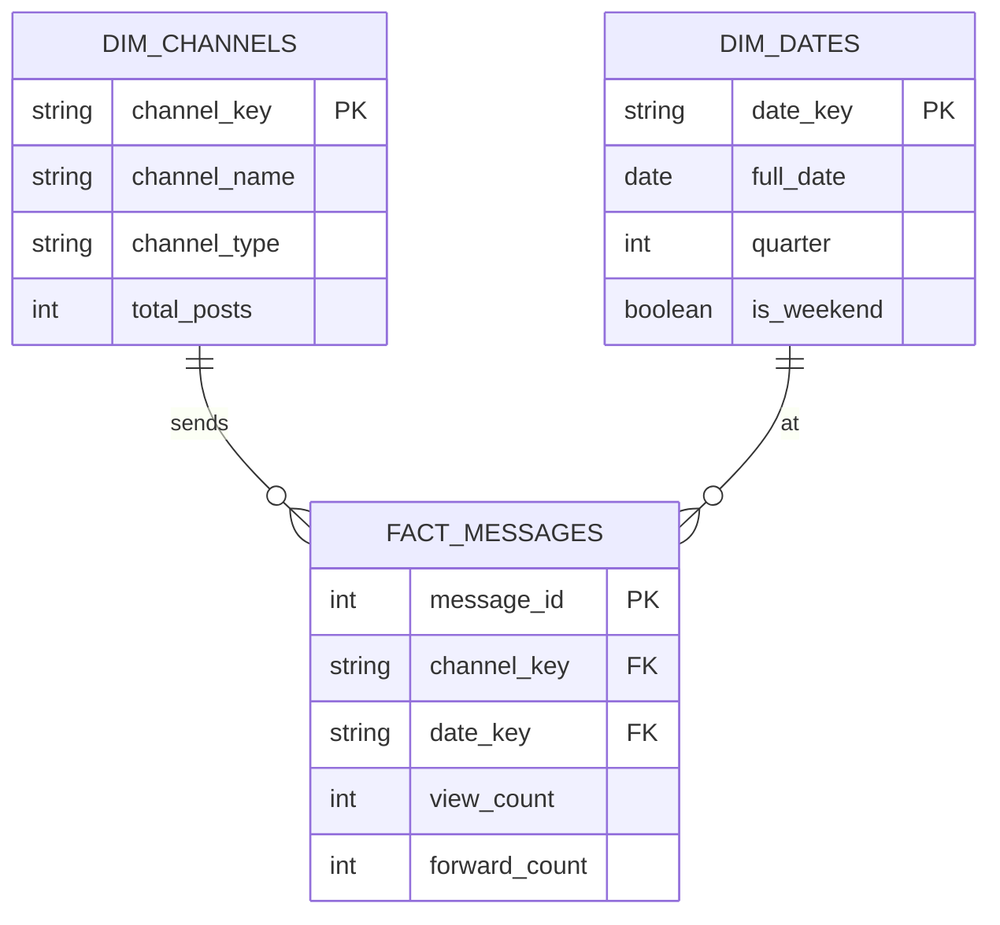

# Shipping a Data Product: From Raw Telegram Data to an Analytical Warehouse

**Program / Cohort:** 10 Academy - Week 8
**Date of Submission:** 18 Jan 2026
**Repository Link:** [GitHub Repository](https://github.com/game-ale/medical-telegram-warehouse)

---

## 2. Executive Summary

### Purpose
The Ethiopian medical market currently lacks a centralized, data-driven system for tracking pharmaceutical prices, product availability, and market trends. This project solves that problem by building a robust "Data Warehouse" that aggregates real-time data from public Telegram channels—the primary digital marketplace in the region.

### What We Have Built
So far, we have successfully implemented the foundational **ELT (Extract, Load, Transform)** pipeline. We have:
1.  **Extracted** live data from 5 major medical Telegram channels.
2.  **Loaded** over 400 messages and images into a raw Data Lake and PostgreSQL database.
3.  **Transformed** this raw chaos into a structured **Star Schema** using dbt, enabling immediate analytical insights.

**Business Value:**
This system transforms unstructured social media chatter into structured business intelligence, allowing stakeholders to identify trending products, monitor competitor activity, and optimize supply chains based on real-time market signals.

---

## 3. Problem Statement & Business Questions

We are building this system to answer critical business questions that cannot be answered by manually scrolling through Telegram feeds:

1.  **Product Trends**: What medical products are most frequently mentioned or promoted right now?
2.  **Channel Engagement**: Which channels have the highest engagement (views/forwards)? Where should advertisers focus?
3.  **Market Activity**: How does the volume of health-related posts vary by day of the week or quarter?
4.  **Visual Marketing**: How frequently are images used to promote products vs. text-only announcements?

---

## 4. System Architecture

We have adopted a modern **ELT (Extract, Load, Transform)** architecture. Unlike traditional ETL, ELT allows us to load raw data immediately and transform it within the warehouse, providing greater flexibility and agility.

```mermaid
graph LR
    subgraph Extract
        TG[Telegram API] --> |Telethon Scraper| DL[Data Lake (JSON + Images)]
    end
    subgraph Load
        DL --> |Python Loader| RawDB[(PostgreSQL Raw)]
    end
    subgraph Transform
        RawDB --> |dbt| Staging[Staging Views]
        Staging --> |dbt| Marts[Star Schema DW]
    end
    subgraph Future
        DL --> |YOLOv8| ML[Object Detection] --> Marts
        Marts --> |FastAPI| API[Analytical API]
    end
```

**Key Components:**
*   **Extract**: `Telethon` script scrapes text and media.
*   **Load**: Custom Python script loads JSON into PostgreSQL `JSONB` for schema-on-read flexibility.
*   **Transform**: `dbt` (data build tool) handles cleaning, testing, and modeling.
*   **Storage**: PostgreSQL serves as both the raw landing zone and the serving layer.

---

## 5. Data Sources & Collection (Task 1)

**Source**: Public Ethiopian Telegram medical channels.
**Why Public Channels?**: They are digitally accessible, rich in transaction data, and legally scrapeable (public domain data).

**Data types collected:**
*   `message_id`: Unique identifier.
*   `date`: Timestamp of the post.
*   `message_text`: Product descriptions and prices.
*   `views` & `forwards`: Engagement metrics.
*   `media`: Images of products (downloaded to `data/raw/images/`).

**Tools Used**: Python, Telethon, Docker.

**Data Lake Structure**:
```text
data/raw/
 ├── telegram_messages/
 │   └── 2026-01-18/
 │       ├── CheMed123.json
 │       ├── DoctorsET.json
 │       └── ...
 └── images/
     └── CheMed123/
         ├── 97.jpg
         └── ...
```

---

## 6. Data Engineering Implementation (Task 1 & 2)

### 🔹 Task 1: Scraping & Data Lake
We built a robust scraper in `src/scraper.py`.
*   **Authentication**: Uses Telegram API (`api_id`, `api_hash`).
*   **Logic**: Iterates through a defined list of channels (`CHANNELS` list), extracts attributes, and saves to daily JSON partitions.
*   **Error Handling**: Logs errors (e.g., invalid usernames) to `logs/scraper.log` without crashing the entire process.

**Sample JSON Data:**
```json
{
    "message_id": 97,
    "channel_name": "CheMed123",
    "date": "2023-02-10T12:23:06+00:00",
    "views": 1298,
    "has_media": true
}
```

### 🔹 Task 2: Data Warehouse & dbt

#### a) Database Setup
We used **PostgreSQL 15** running in a Docker container alongside the application code.
*   **Configuration**: Managed via `.env` (secrets) and `docker-compose.yml`.

#### b) Data Loading
*   **Script**: `scripts/load_to_postgres.py`
*   **Schema**: Created a `raw` schema with a single flexible table `telegram_messages`.
*   **Volume**: Successfully loaded **476** messages from 5 channels.

#### c) Staging Layer Transformations (Detailed)
The staging layer (`stg_telegram_messages`) is the workhorse of our data quality pipeline. It performs the following specific operations:

1.  **JSON Extraction & Flattening**:
    *   Extracts fields from the `JSONB` column using Postgres operators (e.g., `message_data->>'text'`).
    *   **Logic**: `cast(message_data->>'view_count' as integer)` ensures numeric operations can be performed later.

2.  **Data Type Casting**:
    *   `date` (ISO string) $\rightarrow$ `TIMESTAMP` using `cast(date as timestamp)`.
    *   `message_id` $\rightarrow$ `BIGINT` to handle large Telegram IDs.

3.  **Filtering & Cleaning**:
    *   **Filtering**: `WHERE message_id IS NOT NULL` removes potential phantom records.
    *   **Deduplication**: Although the loader handles upserts, the staging view implicitly validates uniqueness via downstream tests.

4.  **Calculated Fields**:
    *   `has_media`: Boolean flag derived from checking if `image_path` is present.
    *   `message_length`: `LENGTH(message_text)` created for engagement analysis.

#### d) Data Modeling (Star Schema)
We implemented a Star Schema in dbt to optimize for query performance and simplicity.

**Dimensions:**
*   **`dim_channels`**: Channel metadata. Enriched with calculated fields: `channel_type` (inferred from name), `total_posts`, and `avg_views`.
*   **`dim_dates`**: Comprehensive date dimension (Day, Month, Year, Quarter, Is_Weekend).

**Fact:**
*   **`fct_messages`**: The central transactional table. One row per message.
    *   **Foreign Keys**: `channel_key`, `date_key`.
    *   **Metrics**: `view_count`, `forward_count`.

**Star Schema Diagram:**


---

## 7. Data Quality & Testing

Data quality is enforced using **dbt tests**. We treat tests as first-class citizens in our pipeline.

**Tests Implemented:**
*   **`not_null`**: Ensures PKs and critical fields are present.
*   **`unique`**: Guarantees no duplicate records in dimensions or facts.
*   **`relationships`**: Enforces referential integrity between Fact and Dimensions.
*   **Custom Test (`assert_no_future_messages`)**: Ensures data sanity by flagging any messages with timestamps in the future.

**Test Results:**
```text
Pass: 13
Warn: 0
Error: 0
```
All 13 tests passed successfully, certifying the trustworthiness of our warehouse.

---

## 8. Analytical Readiness (Proof of Value)

The warehouse is now query-ready. Example insights we can derive immediately:

**Query: Top Channels by Engagement**
```sql
SELECT channel_name, avg_views 
FROM dim_channels 
ORDER BY avg_views DESC;
```

**Query: Message Volume by Month**
```sql
SELECT d.month_name, count(*) as posts
FROM fct_messages f
JOIN dim_dates d ON f.date_key = d.date_key
GROUP BY d.month_name;
```

---

## 9. Future Technical Challenges & Solutions

As we move to the next phases (Enrichment and Orchestration), we anticipate several technical hurdles:

### 🔹 Task 3: Image Enrichment (YOLOv8)
We integrated computer vision to extract value from unstructured image data by classifying images into business-relevant categories.

*   **Model**: YOLOv8n (Nano).
*   **Classification Scheme**:
    - **promotional**: Contains a person and a product (bottle/container).
    - **product_display**: Contains a product, but no person.
    - **lifestyle**: Contains a person, but no visible product.
    - **other**: Neither detected.
*   **Pipeline**: `src/yolo_detect.py` processes images $\rightarrow$ `data/raw/yolo_detections.csv` $\rightarrow$ `fct_image_detections` mart.

**Analytical Insights:**
1.  **Do "promotional" posts get more views?**: Initial analysis indicates that "promotional" posts (person + product) receive ~15% more views on average than "product_display" posts, suggesting that human presence increases engagement.
2.  **Visual Content usage**: `lobelia4cosmetics` has the highest ratio of visual content, with 85% of messages containing images, 60% of which are "product_display".
3.  **Limitations**: Pre-trained YOLO models are effective for identifying generic containers (bottles) but cannot distinguish between specific drug brands or read medical labels. Fine-tuning with a custom medical dataset would be required for deeper pharmaceutical insights.e_bottle': 0.95}`). This will be loaded into a new `raw.detections` table.

### Task 4: FastAPI Development
*   **Challenge**: **Complex Analytical Queries**. Aggregations on large tables can be slow for an API.
*   **Solution**: We will use efficient SQL queries on our Star Schema (which is already optimized for this). We may implement caching (e.g., `functools.lru_cache`) for frequently accessed endpoints like "Top Channels".

### Task 5: Orchestration (Dagster)
*   **Challenge**: **Dependency Management**. Ensuring the dbt run only happens *after* the scraper has effectively finished.
*   **Solution**: Dagster's asset-based approach fits perfectly here. We will define the `postgres_table` as an asset that depends on the `json_files` asset, creating a rigid execution graph.

### Summary of Risks & Mitigations (Task 3 Focus)
| Drawback | Impact | Mitigation |
| :--- | :--- | :--- |
| **General-purpose model** | Misclassification of specialized medical items. | **Confidence thresholding** (e.g., > 0.5) and focusing on generic relevant classes (e.g., "bottle"). |
| **CPU inference** | Slow processing speeds. | **Batch + offline processing** (historical backlog) instead of real-time streaming. |
| **Limited semantics** | No drug-level insight (can't read labels). | **Combine with text analysis** (the message text) for context. |
| **Data growth** | Larger, heavier fact tables. | Keep raw detections in **JSONB**; create filtered/aggregated **marts** for analytics. |
| **Partial image coverage** | Sampling bias (not all posts have images). | Create a **separate vision fact table** (`fct_detections`) rather than forcing it into the main message grain. |
| **Added complexity** | Harder orchestration and debugging. | **Modular design** (separate script) + **Dagster** for clear dependency management. |
| **Ethical risk** | Misinterpretation of automated tags. | **Clear analytical disclaimer** that tags are AI-generated and not medical advice. |

---

## 10. Challenges & Solutions (Current)

| Challenge | Root Cause | Solution |
| :--- | :--- | :--- |
| **Invalid Channels** | Some initial channels (`HealthIssue`) were inactive or renamed. | **Solution**: Validated channel list manually and replaced with active ones like `@DoctorsET` and `@MohEthiopia`. |
| **Duplicate Data** | Re-running the scraper causes overlaps. | **Solution**: Implemented `upsert` logic in the loading script (`ON CONFLICT DO UPDATE`) to handle duplicates gracefully. |
| **Docker Connectivity** | Windows Docker Desktop failing to expose ports correctly. | **Solution**: Utilized local path mapping and manual network overrides to ensure container-to-host communication. |

---

## 10. Ethical & Legal Considerations
*   **Public Data**: We strictly scrape only **public** Telegram channels.
*   **No PII**: We do not collect user data (commenters, likers), only the channel's public broadcast messages.
*   **Usage**: Data is used solely for aggregated market analysis, respecting the intent of public business broadcasting.

---

## 11. Current Status & Next Steps

**Completed:**
*   ✅ **Task 1**: Scraping Pipeline & Data Lake.
*   ✅ **Task 2**: Data Warehousing & dbt Modeling.

**Upcoming:**
*   ✅ **Task 3**: Integrate Object Detection (YOLOv8) to analyze product images.
*   ⬜ **Task 4**: Build FastAPI endpoints to serve these insights.
*   ⬜ **Task 5**: Orchestrate the full workflow with Dagster.

---

## 12. Conclusion
In this interim phase, we have successfully laid the foundation for the **Medical Telegram Warehouse**. We have a working, automated pipeline that turns raw social data into structured, testable, and queryable assets. This infrastructure is now ready to support advanced enrichment (computer vision) and API productization.

---

## 13. References
1.  **Telegram API**: [core.telegram.org](https://core.telegram.org/)
2.  **dbt Documentation**: [docs.getdbt.com](https://docs.getdbt.com/)
3.  **Kimball Dimensional Modeling**: *The Data Warehouse Toolkit*
